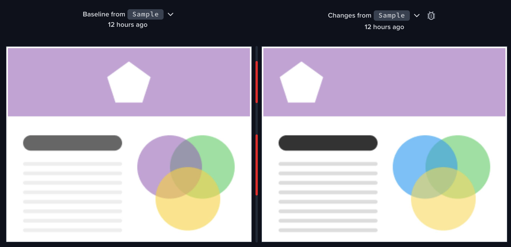
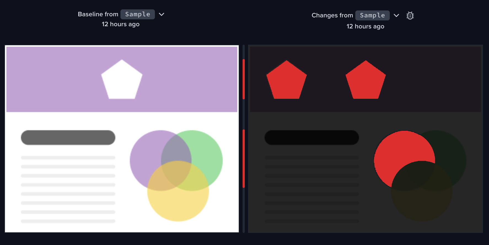

# Percy Quickstart

<!-- シールド一覧 -->
<!-- 該当するプロジェクトの中から任意のものを選ぶ-->

  <!-- フロントエンドのフレームワーク一覧 -->
  
  

## Overview

This project aims to detect differences between two images using a visual testing tool Percy.

## Development Environment

<!-- コンテナの作成方法、パッケージのインストール方法など、開発環境構築に必要な情報を記載 -->

### Technical Stacks

| Frameworks / Packages  | Version         | 
| ---------------------- | --------------- | 
| Node                   | 20.16.0         |
| @percy/cli             | 1.30.2          |

### Environmental Variables

| Variable Name          | Description                         | 
| ---------------------- | ----------------------------------- | 
| PERCY_TOKEN            | Percy Token of the target project   |
| PERCY_BRANCH           | Percy Branch Name                   |

## Verify that it works

1. create `.env` file and set environment variables.
2. Set `v1` image in `index.html` and run `npx run snapshot` command.
3. Set `v2` image in `index.html` and run `npx run snapshot` command.

## Results
### Input

### Output
